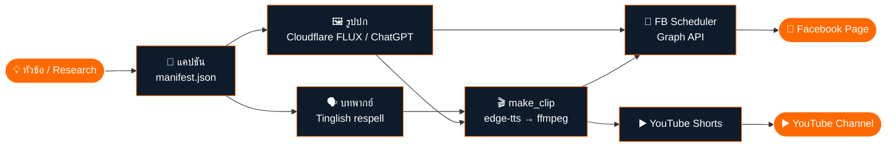
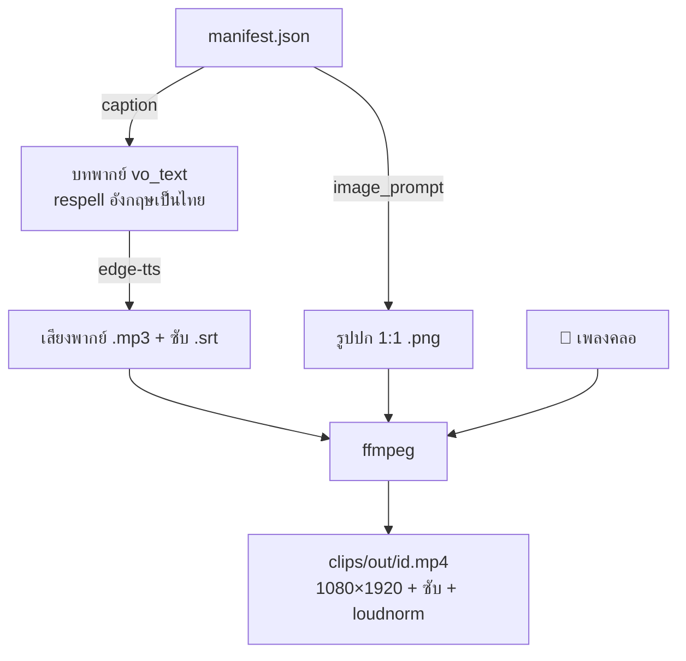
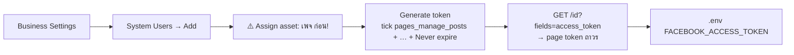

<div align="center">


# 📣 fbytpost

### โรงงานคอนเทนต์อัตโนมัติ — จาก "ไอเดีย" สู่ "ตารางโพสต์จริง" บน Facebook + YouTube
**A research-to-publish content pipeline for Facebook Pages & YouTube Shorts**

<br/>


</div>

---

## 🎯 ทำอะไรได้บ้าง (What it does)

แปลงหัวข้อเดียวให้กลายเป็น **คอนเทนต์ครบชุดพร้อมตารางเวลา** โดยอัตโนมัติ — เขียนแคปชัน, สร้างรูปปก, ทำคลิปวิดีโอแนวตั้งพร้อมเสียงพากย์+ซับ, แล้ว **ตั้งเวลาโพสต์ลงเพจ Facebook และอัปขึ้น YouTube Shorts** ในคำสั่งเดียว

> เครื่องมือชุดนี้ใช้จริงผลิต **โพสต์ 100 + รูปปก 100 + Reel 100** สำหรับเพจ 166k ภายในคืนเดียว แล้วตั้งเวลายิงครบ 200 ชิ้นใน 30 วัน 🚀

| | ฟีเจอร์ | สคริปต์ |
|---|---|---|
| 📝 | โพสต์ทันที / ตั้งเวลาโพสต์รูป-ข้อความลงเพจ | `facebook/post_now.mjs`, `schedule_post.mjs` |
| 📅 | กระจายคอนเทนต์ 100+ ชิ้นลงปฏิทินอัตโนมัติ (เวลาทอง, ป้องกันยิงซ้ำ) | `facebook/schedule_spread.mjs`, `schedule_campaign.mjs` |
| 💬 | Broadcast Messenger ภายในกรอบนโยบาย 24 ชม. (กรองจาก inbound จริง) | `facebook/messenger_broadcast.mjs` |
| 🔑 | ดึง Page Access Token ผ่านเบราว์เซอร์ (Playwright/CDP) | `facebook/mint_page_token.mjs` |
| 🖼️ | สร้างรูปปก 1:1 ฟรี (Cloudflare Workers AI — FLUX) | `content/gen_cf.mjs` |
| 🎬 | ทำ Reel 9:16 = เสียงไทย (edge-tts) + ซับวิ่ง + เพลงคลอ + ffmpeg | `content/make_clip.mjs`, `batch_clips_loop.mjs` |
| ▶️ | อัป Reel ขึ้น YouTube Shorts + ตั้งเวลา (sync กับ FB) | `youtube/yt_batch.mjs`, `upload_yt.py` |

---

## 🏗️ สถาปัตยกรรม (Architecture)



### 🎬 ขั้นตอนทำคลิป (Reel pipeline — ไม่ต้องมี GPU)



---

## 📂 โครงสร้างโปรเจกต์

```
fbytpost/
├─ facebook/
│  ├─ post_now.mjs            # โพสต์ลงเพจทันที
│  ├─ schedule_post.mjs       # ตั้งเวลาโพสต์ข้อความ
│  ├─ schedule_campaign.mjs   # ตั้งเวลาโพสต์รูปแบบ batch (2/วัน)
│  ├─ schedule_spread.mjs     # ⭐ กระจาย 200 ชิ้นลง 30 วัน เวลาทอง (idempotent)
│  ├─ messenger_broadcast.mjs # broadcast Messenger ใน 24 ชม.
│  └─ mint_page_token.mjs     # ดึง page token ผ่าน Playwright/CDP
├─ content/
│  ├─ gen_cf.mjs              # สร้างรูปปกฟรีด้วย Cloudflare FLUX
│  ├─ make_clip.mjs           # ⭐ ทำ Reel 1 คลิป (edge-tts + ffmpeg)
│  ├─ batch_clips_loop.mjs    # ทำคลิปทั้งหมดแบบวนรอรูป
│  ├─ assemble.mjs            # รวมโพสต์ → manifest.json
│  └─ merge_vo.mjs            # รวมบทพากย์ → clips_vo.json
├─ youtube/
│  ├─ yt_batch.mjs            # ⭐ อัป Reel ขึ้น YouTube Shorts (quota ~6/วัน)
│  └─ upload_yt.py            # ตัวอัปโหลด YouTube (OAuth)
├─ examples/manifest.sample.json
├─ .env.example
└─ README.md
```

---

## 🚀 เริ่มใช้งาน (Quick Start)

```bash
# 1) ติดตั้ง
npm install            # (ใช้แค่ playwright สำหรับ mint token; สคริปต์อื่นใช้ fetch ในตัว Node 20+)
pip install edge-tts   # สำหรับทำเสียงพากย์
# ต้องมี ffmpeg ในเครื่องด้วย

# 2) ตั้งค่า
cp .env.example .env   # ใส่ FACEBOOK_PAGE_ID + FACEBOOK_ACCESS_TOKEN

# 3) เตรียมคอนเทนต์ (manifest.json = [{id, image_headline_th, image_prompt, caption}, ...])
node content/gen_cf.mjs            # สร้างรูปปก
node content/batch_clips_loop.mjs  # ทำคลิป Reel

# 4) ตั้งเวลา / โพสต์
node facebook/schedule_spread.mjs            # DRY RUN (ดูตารางก่อน)
node facebook/schedule_spread.mjs --confirm  # ยิงจริง
node youtube/yt_batch.mjs --limit 6          # อัป YouTube Shorts
```

> 💡 ทุกสคริปต์ตั้งเวลาเป็น **DRY RUN ก่อนเสมอ** — ต้องใส่ `--confirm` ถึงจะยิงจริง และมี **state file กันยิงซ้ำ** (รันต่อได้ถ้าเน็ตหลุด)

---

## 🔑 การเอา Page Token ให้โพสต์ได้ (สิ่งที่คนติดบ่อยที่สุด)

ในระบบ **"Use Cases" ใหม่ของ Meta** สิทธิ์ `pages_manage_posts` มัก **ไม่โผล่** ใน Graph API Explorer วิธีที่ชัวร์สุดคือ **System User token**:



---

## 🧠 บทเรียนจากของจริง (Lessons / Gotchas)

<table>
<tr><th>ปัญหา</th><th>ทางแก้ในโค้ดนี้</th></tr>
<tr><td>🔒 <code>pages_manage_posts</code> ไม่โผล่ใน Graph Explorer (Use Cases ใหม่)</td><td>ใช้ <b>System User token</b> (Never-expire) → derive page token; <b>ต้อง assign เพจเป็น asset ก่อน</b> ไม่งั้น error #200</td></tr>
<tr><td>💬 Broadcast Messenger เด้ง #10 ทั้งที่ดูเหมือนเพิ่งคุย</td><td>กรองจาก <b>เวลา inbound ล่าสุดของลูกค้าจริง</b> ไม่ใช่ <code>updated_time</code> (ที่ขยับตอนเพจส่งออกเองด้วย)</td></tr>
<tr><td>🖼️ ChatGPT เจนรูปติดโควต้า (~40 รูป/วัน)</td><td>fallback อัตโนมัติไป <b>Cloudflare Workers AI (FLUX)</b> — ฟรี ไม่มี cap ไม่ต้อง GPU</td></tr>
<tr><td>🎬 Reel ตั้งเวลาล่วงหน้าได้แค่ ~30 วัน (กฎ FB)</td><td>ตัวจัดเวลาเช็ค cap แล้ว defer ตัวที่เกิน + รันซ้ำเก็บภายหลัง</td></tr>
<tr><td>🗣️ TTS อ่านคำอังกฤษเพี้ยน</td><td>respell อังกฤษเป็น "คำอ่านไทย" (Tinglish) ก่อนป้อน edge-tts</td></tr>
<tr><td>🌐 เน็ตหลุดกลางการยิง batch</td><td><b>fixed-slot per item + state file</b> → รันซ้ำลงต่อที่เดิม ไม่กระจุก ไม่ซ้ำ</td></tr>
</table>

---

## 🛠️ Tech Stack

`Node.js 20+ (native fetch)` · `Facebook Graph API v22` · `Playwright/CDP` · `edge-tts` · `ffmpeg` · `Cloudflare Workers AI (FLUX)` · `YouTube Data API v3`

## ⚖️ ข้อควรระวัง
ใช้กับ **เพจ/ช่องของคุณเอง** และอยู่ในนโยบายของแพลตฟอร์มเสมอ (เช่น Messenger 24‑ชม. window) · อย่า commit `.env` / token เด็ดขาด (มี `.gitignore` กันไว้แล้ว)

## 📜 License
[MIT](LICENSE) © ksmaster03

<div align="center"><br/><sub>Built with ❤️ + 🤖 — generate, schedule, publish. Repeat.</sub></div>
